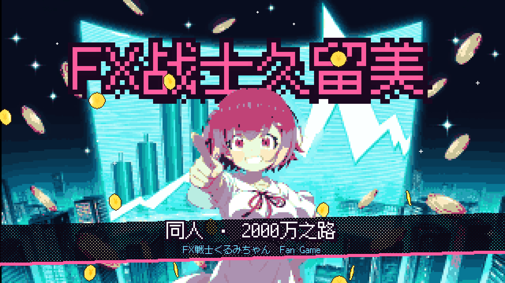
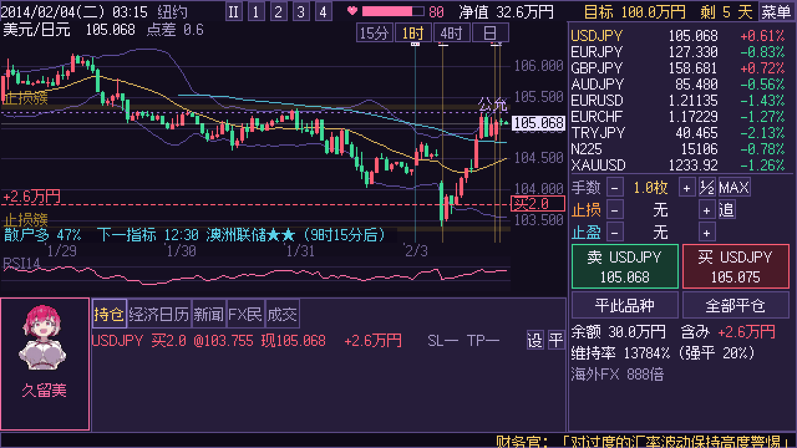
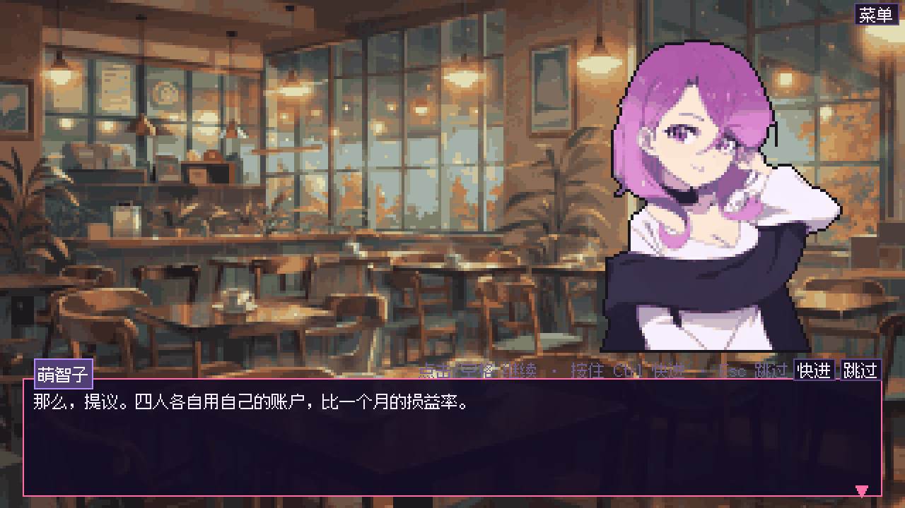
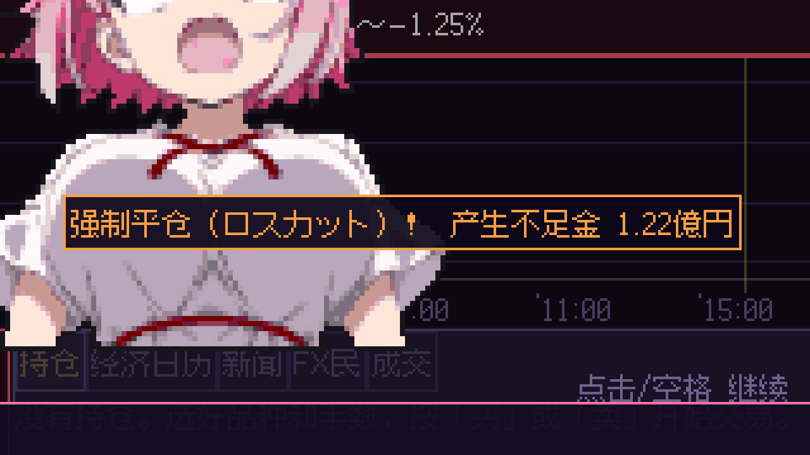
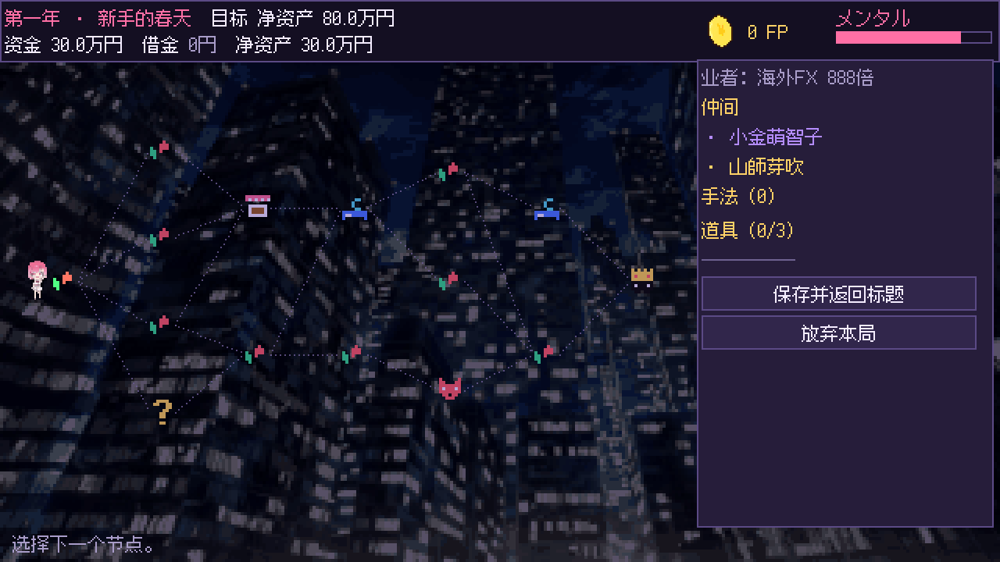
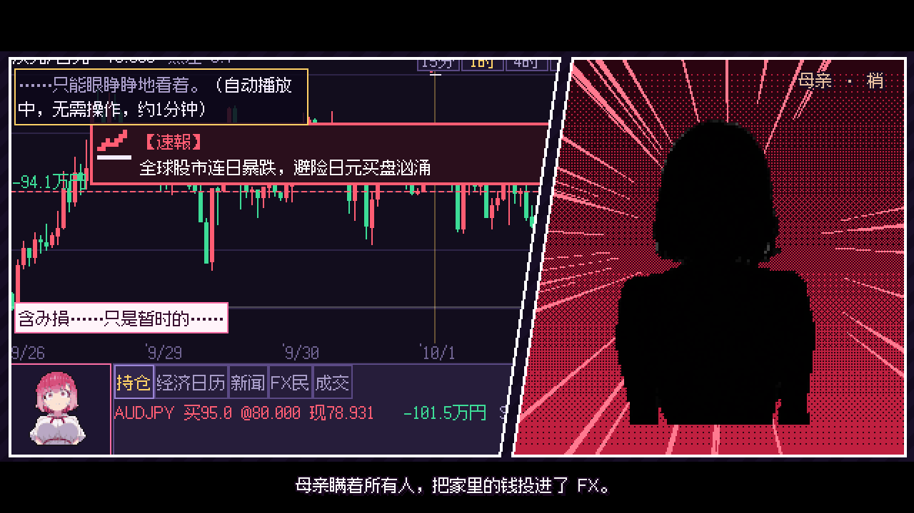
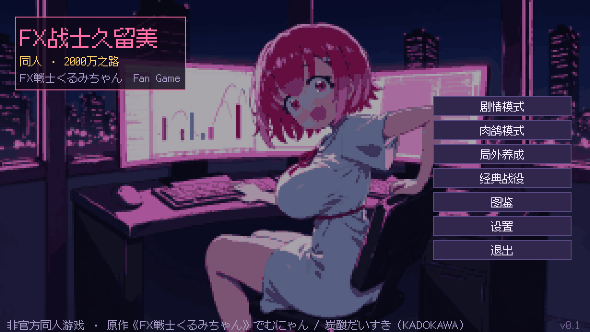

<div align="center">



#  FX战士久留美 同人 · 2000万之路

**像素风 · 实时外汇交易 · 肉鸽构筑**

《FX戦士くるみちゃん》（原作 でむにゃん / 作画 炭酸だいすき，KADOKAWA）的**非官方同人游戏**

[](https://github.com/zeroa234/kurumi-fx-rogue/releases/latest)
[](https://godotengine.org/)
[](https://github.com/zeroa234/kurumi-fx-rogue/releases/latest/download/kurumi-fx-rogue-windows-x64.zip)
[](https://github.com/zeroa234/kurumi-fx-rogue/releases/latest/download/kurumi-fx-rogue-android.apk)
[](#原作与素材说明)


</div>

> 2008 年秋，母亲在雷曼冲击里亏掉了 **2000 万円**。
> 大学生福賀久留美带着 30 万円，走进了外汇市场——这一次，轮到你来交易。

## 下载

| 平台 | 下载 | 说明 |
|---|---|---|
| **Windows** | [kurumi-fx-rogue-windows-x64.zip](https://github.com/zeroa234/kurumi-fx-rogue/releases/latest/download/kurumi-fx-rogue-windows-x64.zip) | 解压后双击 `kurumi-fx-rogue.exe`。未做代码签名，SmartScreen 提示时点「更多信息 → 仍要运行」 |
| **Android** | [kurumi-fx-rogue-android.apk](https://github.com/zeroa234/kurumi-fx-rogue/releases/latest/download/kurumi-fx-rogue-android.apk) | 需要允许「安装未知来源应用」。横屏，arm64-v8a / armeabi-v7a |
| **宣传 PV** | [kurumi-fx-rogue-pv.mp4](https://github.com/zeroa234/kurumi-fx-rogue/releases/latest/download/kurumi-fx-rogue-pv.mp4) | 1080p，71 秒（游戏首次启动时也会播放，可跳过） |

全部版本见 [Releases](https://github.com/zeroa234/kurumi-fx-rogue/releases)。

## 画面

<table>
<tr>
<td width="50%"><br><sub><b>实时行情</b>：9 个品种，经济日历、新闻速报、FX 民时间线同时在跑</sub></td>
<td width="50%"><br><sub><b>剧情模式</b>：跟着漫画逐卷改编，第 1~15 章</sub></td>
</tr>
<tr>
<td><br><sub><b>复刻名场面</b>：2015-01-15 瑞郎冲击，强制平仓、不足金 1.22 亿円</sub></td>
<td><br><sub><b>肉鸽模式</b>：3 幕分叉地图，相場 / 精英 / 事件 / 商店 / 休息 / Boss</sub></td>
</tr>
<tr>
<td><br><sub>开场 PV · 序章</sub></td>
<td><br><sub>标题画面</sub></td>
</tr>
</table>

## 登场人物

<div align="center">


| 福賀 久留美 | 小金 萌智子 | 山師 芽吹 | 高根 やす子 |
|:---:|:---:|:---:|:---:|
| 主角。目标 2000 万円 | 冷眼分析，看穿隐藏趋势 | 每天喊单，大约 3/4 是反的 | 博客煽动散户情绪 |

</div>

## 玩法

**行情是活的。** 价格由多因子算法实时生成：经济指标（非农、CPI、利率决议……）、央行意外、自然灾害、政治新闻、谣言与辟谣、要人发言、
散户情绪与止损猎杀、朋友的博客，都会推动价格。可以随时暂停、1~4 档变速，在图表上直接拖动止损 / 止盈线改单。

**久留美会上头。** 连亏、强平、浮亏都会消耗「メンタル」，太低就会暴走乱下单。

| 模式 | 内容 |
|---|---|
| 📖 **剧情模式** | 15 章，覆盖原作第 1~53 話。第 1~6 章是新手教程，第 11 章复刻瑞郎冲击 |
| 🎲 **肉鸽模式** | 3 幕，净资产目标 80 万 → 400 万 → 2000 万円。30 种手法、10 种道具、5 种诅咒、18 个事件、6 个精英与 6 个 Boss、4 家 FX 业者、3 位仲间。通关后有无尽模式与挑战度 1~10 |
| 🌱 **局外养成「相場勘」** | 21 项永久强化：起始资金、メンタル、仲间位、新品种、新业者…… |
| ⚔️ **经典战役 / 图鉴** | 重玩剧情里的战役，收集手法、道具、事件与 Boss |

交易品种：USD/JPY · EUR/USD · GBP/JPY · AUD/JPY · EUR/JPY · EUR/CHF · TRY/JPY · 日经 225 · 黄金。

## 操作

**键盘鼠标**：空格 暂停/继续 · 1~4 速度 · B 买 · S 卖 · C 全部平仓 · Tab 切换品种 · Esc 菜单 · F11 全屏
图表：滚轮缩放 · 右键拖动 · 左键拖动持仓的 SL/TP 线改单。
对话：点击 / 空格 继续 · 按住 Ctrl（或按住鼠标）快进 · Esc 跳过本段；剧情中 Esc / 右上「菜单」可返回章节选择。

**手机（Android）**
- 对话：**轻点**继续（一次只前进一句）· **长按**快进 · 对话框右上「快进」（开关）「跳过」。
- 剧情 / 交易中右上「菜单」或**返回键**＝暂停菜单（继续 / 返回章节选择 / 返回标题；肉鸽为保存并退出）；菜单界面按返回键回标题，标题画面连按两次返回键退出。
- 交易：每个功能都有屏幕按钮（买卖 / 平此品种 / 全部平仓 / Ⅱ 1~4 速度 / 品种行切换 / 手数 ± ½ MAX / 止损止盈 ±）；**长按按钮**显示说明（松手不会触发）。
- 图表：单指拖动空白处平移 · 双指捏合缩放 · 拖持仓的 SL/TP 线改单。
- 显示用小数缩放铺满宽度，非 16:9 屏幕上下留黑边。

**开场 PV**：首次启动自动播放；按任意键 / 轻点一次出现「再按一次跳过」，再按一次跳过。设置里可以重看，或改成每次启动都播放。

## 原作与素材说明

- 本作是**非官方同人作品**，与原作者、KADOKAWA 及动画制作方无关。
- 剧情事实只采用调研文档中有出处的内容；台词为转述，不照搬原作对白，不使用原作图片。游戏原创部分在章节 `original` 字段中注明。
- 复刻的真实行情只使用公开报道中的关键价位（来源写在章节 `source` 字段）；其余行情为算法生成，**不构成任何投资建议**。
- 美术为 AI 生成后像素化：久留美立绘用 Anima + 角色 LoRA；萌智子 / 芽吹 / やす子以动画官网立绘为参考（IC 方法）；父母无官方立绘，用剪影。PV 配乐与游戏 BGM（24 首纯器乐）为 YuE2 本地生成。
- 字体 [Fusion Pixel Font](https://github.com/TakWolf/fusion-pixel-font)（SIL OFL 1.1）。

---

## 开发

Godot **4.7.2**（GDScript，`gl_compatibility` 渲染器），视口 640×360。以下命令都在本仓库根目录执行。

```bash
G=D:/godot/Godot_v4.7.2-stable_win64_console.exe
$G --headless --path . --import   # 首次运行 / 新增脚本或素材后先导入
$G --path .                        # 运行（或用 Godot 编辑器打开本目录）
```
存档在 `%APPDATA%\Godot\app_userdata\FX战士久留美 同人 · 2000万之路\save.json`。
测试时可在标题画面按 **Shift+F9** 解锁全部（教程完成 + 全章已读）。

### 打包
`export_presets.cfg` 里有三个预设，产物都在 `output/`（不入库）：

```bash
$G --headless --path . --export-release "Windows Desktop" output/windows/kurumi-fx-rogue.exe   # 单文件 exe（pck 内嵌）
JAVA_HOME=D:/tools/jdk17/jdk-17.0.13+11 \
$G --headless --path . --export-debug "Android" output/kurumi-fx-rogue.apk                     # debug 签名 APK
$G --headless --path . --export-release "Web" output/web/index.html                            # 网页版（单线程，不需要 COOP/COEP 头）
```
需要对应的 4.7.2 导出模板（Windows `windows_*_x86_64*`、Web `web_nothreads_*`、Android `android_*`），依赖位置见 [维护手册 §7](docs/maintenance.md)。
开场视频 `assets/video/opening.ogv` 由 `python scripts/pv/make_pv.py --game` 生成（见 [docs/pv.md](docs/pv.md) §7）。

### 文档
| 文档 | 内容 |
|---|---|
| [docs/maintenance.md](docs/maintenance.md) | **维护手册**：架构、关键约定与坑、常见维护任务、测试、已知问题 |
| [docs/data-reference.md](docs/data-reference.md) | 所有 JSON 数据、Mods 修正值、存档的字段参考 |
| [docs/story-format.md](docs/story-format.md) | 剧情章节格式、时间线动作、教学步骤条件、章节检查流程 |
| [docs/art-pipeline.md](docs/art-pipeline.md) | 美术素材管线（ComfyUI / LoRA / IC / Blender / 像素化） |
| [docs/bgm.md](docs/bgm.md) | 背景音乐：YuE2 生成方法与实测对比、曲目与场景/各章对应、游戏内接入 |
| [docs/pv.md](docs/pv.md) | 宣传 PV：结构与配乐对齐、实机录制驱动、合成器、素材来源、重新出片、游戏内开场 |
| [docs/GDD.md](docs/GDD.md) | 设计文档（与实现同步，含未实现清单） |
| [docs/research/manga-reference.md](docs/research/manga-reference.md) | 原作调研（剧情事实唯一来源，带出处） |
| [docs/CHANGELOG.md](docs/CHANGELOG.md) | 版本历史 |
| [docs/session-2026-10-07-android-touch.md](docs/session-2026-10-07-android-touch.md) | 会话记录：Android 打包与触屏适配（环境、命令、改动、§9 返工、真机待验、回滚） |

### 目录
| 路径 | 内容 |
|---|---|
| `src/core/` | 行情 `market_sim.gd`、事件 `event_engine.gd`、账户 `account.gd`、交易会话 `trade_session.gd`、心理 `kurumi.gd`、修正值 `mods.gd`、肉鸽 `run_state.gd`、日期、存档、数据、场景切换 |
| `src/ui/` | 交易界面、K 线图、对话框、立绘、像素图标、序列帧、主题、音效 |
| `src/story/` | 剧情播放器、教学导演、章节索引 |
| `src/run/` | 肉鸽：开局、地图、交易节点、结算、局外养成 |
| `src/scenes/` | 启动、开场 PV、标题、章节选择、设置、经典战役、图鉴、调试沙盒 |
| `data/` | 行情/事件/剧情/肉鸽的 JSON 数据 |
| `assets/` | 像素素材、字体（Fusion Pixel，OFL）、音效、BGM、开场视频 |
| `config/` | 素材生成清单 `asset-manifest.json`、PV 剪辑表 |
| `scripts/` | 素材生成、取图、序列帧像素化、Blender 金币、音效合成、PV 合成 |
| `tests/` | 引擎自检、编译检查、存档往返、平衡模拟、战役核对、界面冒烟、教程自动通关、自动播放检查、触屏、开场 |

### 漫画更新时同步剧情
1. 在 `docs/research/manga-reference.md` 补上新话的事实与出处。
2. 按 `docs/story-format.md` 新建 `data/story/chapters/chNN.json`。
3. 按 story-format.md §5 跑检查（编译检查 → 教程驱动 → 自动播放检查 → 战役核对）。

### 测试
```bash
$G --headless --path . res://tests/test_market.tscn      # 行情/账户/强平/钉住撤销自检 → "== 失败 0 =="
$G --headless --path . res://tests/compile_check.tscn    # 全部脚本与数据 → "0 failures"
$G --headless --path . res://tests/test_save.tscn        # 肉鸽存档往返 → "SAVE ROUNDTRIP OK"
$G --path . res://tests/smoke_ui.tscn                    # 界面冒烟（需要窗口，会覆盖本机存档）→ "SMOKE DONE"
$G --path . res://tests/tutorial_driver.tscn             # 教程自动通关 → 每章 "步骤 n/n"
$G --path . res://tests/autoplay_check.tscn              # 自动播放段不卡死 → "0 stalled"
$G --path . res://tests/touch_check.tscn                 # 触屏：轻点/长按/返回键 → "TOUCH CHECK: 0 failures"
$G --path . res://tests/opening_check.tscn               # 开场 PV 跳过逻辑（结束时还原本机存档）→ "OPENING CHECK OK"
$G --headless --path . res://tests/sim_balance.tscn -- --runs=16 --meta=3 --risk=0.1 --oracle   # 平衡模拟
$G --headless --path . res://tests/check_battle.tscn -- --chapter=ch11                         # 战役关键数字
```
截图调试：`$G --path . res://src/run/run_map.tscn -- --newrun --shot=<绝对路径.png> --shot-delay=2`（更多参数见维护手册 §1）。
